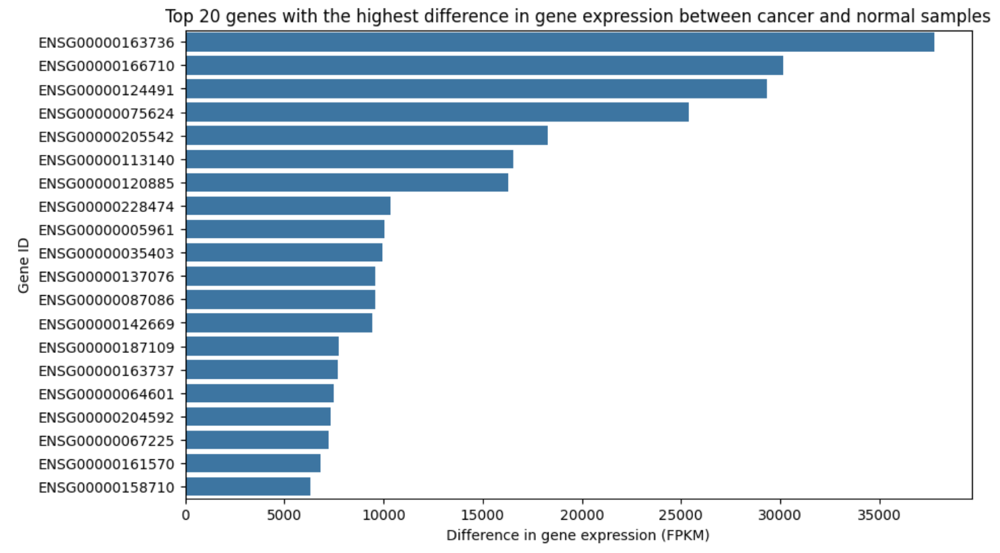
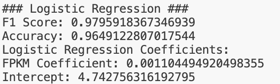
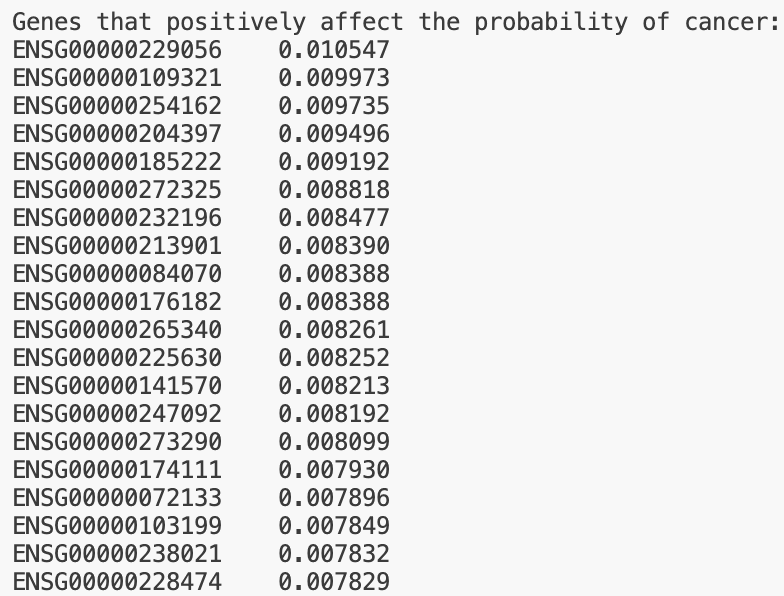

# CS506_Final_Project
## Run the code
1. Download the raw dataset from Kaggle : [Gene Expression Omnibus (GEO) Dataset: GSE68086](https://www.kaggle.com/datasets/samiraalipour/gene-expression-omnibus-geo-dataset-gse68086)
2. Unzip downloaded folder
3. Add contents of unzipped folder to ```data``` folder<br>

>Pre-processed dataset is also available from our Google Drive, you can skip the data processing if you download the clean data [https://drive.google.com/drive/folders/1azEtUWEL36PpT4c7fenRnjUFl9yMfc7q?usp=sharing](https://drive.google.com/drive/folders/1azEtUWEL36PpT4c7fenRnjUFl9yMfc7q?usp=sharing)<br>
```merged_data.csv``` is for visualization in ```data_processing.ipynb```, ```cleaned_data_train.csv``` and ```cleaned_data_test.csv``` are for the actual model<br><br>

5. ```make install``` to install all dependencies<br>
6. ```make data``` to process data<br>
7. ```make run``` to go through model-building steps and make the prediction<br>

## Description

This project aimed to predict the presence of cancer based on gene expression data from the Gene Expression Omnibus (GEO) database. RNA sequencing data from cancer and non-cancer samples was analyzed to identify differences in expression profiles. By focusing on a subset of key genes related to cancer development, the project explored how gene expression patterns differ between cancerous and normal tissues, and whether these patterns can be used to predict the likelihood of cancer.

## Background
Proteins are essential for the fulfillment of critical processes throughout the body. The instructions for making these proteins are encoded in our genes, and proteins are produced through the expression of these genes. When there is a malfunction in this protein-making process, it can lead to diseases such as cancer.

Abnormal gene expression is often a sign of cancer and has been used in personalized medicine to identify targets for precision treatments. The data used to detect abnormal gene expression comes from RNA sequencing (RNA-seq), which measures the frequency of gene expression in cells. RNA-seq provides information about which genes are being expressed and at what levels, based on the presence of RNA. The actual values in RNA-seq data represent counts of RNA fragments that have been mapped (or connected) to specific genes, reflecting how actively a gene is being expressed in a given sample.

## Goals
The main goals were to successfully predict cancer based on the RNA expression levels and identify a few genes of interest. 

The project -

* Built predictive models to classify samples as cancerous or non-cancerous based on RNA expression levels.
* Identified key genes with a significant impact on predicting cancerous or healthy samples.

## Data Collection
Our selected dataset, sourced from the Gene Expression Omnibus (GEO) and hosted on Kaggle, contains RNA sequencing data from Tumor-Educated Platelets (TEPs). TEPs are known to reflect tumor presence in the body, as their RNA profiles change in response to signals released by tumors into the bloodstream. Leveraging TEPs for cancer diagnostics and treatment is an emerging area of research, making this dataset highly relevant for modeling applications.

The dataset is comprised of 283 blood platelet samples, including 55 from healthy individuals, representing the cancer types of non-small cell lung, colorectal, pancreatic, and breast cancer, along with glioblastoma and hepatobiliary carcinomas. Each sample provides expression levels for 57,736 genes. Additionally, the dataset includes intron-spanning data, which offers insights into how tumors may influence RNA splicing—the process of removing non-coding regions from RNA.

## Data Processing 
The initial step in data cleaning was to remove redundant information that would not contribute to predicting cancer through modeling. For example, a column identifying the species from which the sample originated was dropped, as all samples were from humans.

After the midterm checkpoint, our team revisited the data to address the poor performance of the models we had trained. We hypothesized that the issue might stem from data processing steps and also decided to simplify the problem statement to focus solely on predicting the presence or absence of cancer, streamlining our work into a binary classification task.

To accommodate this change in scope, we reformatted our RNA expression data into a long format, where each sample had its own set of gene expression values represented by Sample, gene_ID, and gene expression level (FPKM) columns. We normalized the FPKMs using the formula $\frac{\text{FPKM} - \text{mean}}{\sqrt{\text{variance} + 1e^{-10}}}$​, making sure to avoid dividing by zero or negative variance.

The original dataset we used before the midterm report was in a wide format, where samples were represented as columns, rows corresponded to gene expression levels for specific genes, and cancer type labels were one-hot encoded. While this wide format proved less suitable for modeling, we retained it for better data visualization. Overall, for modeling, we converted the data to long format, allowing for seamless integration of patient information, normalized gene expression values, and binary cancer labels.

## Data Visualization
To better understand the dataset, a series of visualizations were created to highlight gene expression patterns and their potential implications for cancer diagnostics. Note: If you would like to review our full code for data visualization, please refer to ```data_processing.ipynb```

In Figure 3, we observe that the differential expression of genes between breast cancer and normal samples varies significantly. Some genes, such as 166170, show substantial expression differences, suggesting their potential as strong predictors. This gene also appears to be differentially expressed across all cancer samples (Figure 4), indicating its association with cancer in general. According to The Human Protein Atlas, 166170 has low cancer specificity, making it useful for distinguishing between cancerous and non-cancerous samples, though less effective for identifying specific cancer types (_B2M_).

 <br />
Figure 3. Comparison of Top 20 Differentially Expressed Genes in Breast Cancer and Healthy Samples 
 <br />
Figure 4. Comparison of Top 20 Differentially Expressed Genes in Cancer and Healthy Samples

Next, Figure 5 compares the mean values of the top 20 differentially expressed genes between cancerous and healthy samples. While it overlaps somewhat with the information in Figure 4, this heatmap adds context by displaying mean FPKM values, highlighting the origins of these differences. For example, gene 205542 has a notably higher mean FPKM compared to other genes with similar differential expressions.
 <br />
Figure 5. Heatmap Comparison of Top 20 Differentially Expressed Genes Between Cancerous and Healthy Samples

Using a violin plot (Figure 6) helped elucidate the distribution of log-transformed FPKM values across the top 20 differentially expressed genes. A consistent pattern from this chart is that, on average, non-cancerous samples exhibit lower mean FPKM values than cancerous samples. Additionally, certain genes, such as 149311, display a broader distribution or multiple peaks in the non-cancerous samples, a characteristic that could enhance model performance.

 <br />
Figure 6. Violin Plot of Top 20 Differentially Expressed Genes (Log FPKM)

During this visualization process, it became evident that gene expression levels required normalization due to wide variability in values. Normalizing expression differences ensured that patterns reflected biological relevance rather than technical variability. Figure 7 shows the top 20 differentially expressed genes after normalization, illustrating how this step helped clarify the data for further analysis.

 <br />
Figure 7. Comparison of Top 20 Normalized Differentially Expressed Genes between Cancerous and Healthy Samples. 

Following this, Figure 8 provides insight into how FPKM values vary within each of the top 20 differentially expressed genes. Some genes show much wider distributions of expression levels than others. For instance, gene 187109, which has low cancer specificity, displays a tight distribution compared to gene 163736 (_NAP1L1_; _PPBP_), which is specifically associated with colorectal cancer. These distribution characteristics are essential considerations when building a model, as they may impact predictive accuracy.

 <br />
Figure 8. Facet Grid of FPKM Distribution of Top 20 Differentially Expressed Genes


## Modeling Approach
To model the data, we explored several machine learning methods -

* Linear and Logistic Regression - We built two simple models as a baseline to assess how well gene expression levels can predict cancer. We noted that these might be particularly valuable because of their interpretability, something required by medical professionals and biologists. Full Code: ```Linear_and_Logistic_Regression.ipynb```

* Random Forest - To capture more complex interactions between gene expression levels and cancer classification, we implemented a nonlinear Random Forest model. This approach allowed us to explore patterns that might not be captured by simpler linear models. Full Code: ```randomForest_afterMidtermProgress.ipynb```

* XGBoost - We applied XGBoost, a tree-based ensemble method, to determine whether it could outperform the simpler models by leveraging its ability to model intricate relationships and handle large feature spaces efficiently. Full Code: ```xgboost_afterMidtermProgress.ipynb```

* Neural Network - Finally we trained a neural network, wondering if there were even more complex patterns in the gene expression data that could be elucidated. In contrast to the simpler models, we were very aware that neural networks are difficult to explain which may make them less useful for precision medicine. Full Code: ```neural_network_hyp_tuning.ipynb```

## Testing and Performance Metrics 
Testing involved splitting the data into training and testing sets -

80-20 split - 80% of the dataset was used for training the model, and the remaining 20% was withheld for testing the model’s performance. Using this split gave us 226 samples in our train set and 57 samples in our test set. 

Performance Metrics - Models were primarily evaluated based on the F1-score due to the imbalanced nature of the dataset, with far fewer healthy samples compared to cancerous ones. The F1-score is well-suited for this scenario because it provides a harmonic mean of precision and recall, ensuring that both false positives and false negatives are considered equally. This is crucial in cancer classification, where a model's ability to correctly identify cancer cases (high recall) must be balanced with minimizing the misclassification of healthy individuals as having cancer (high precision).

While accuracy can often be misleading in imbalanced datasets—because it may be inflated by the majority class—F1-score reflects the true effectiveness of the model in predicting the minority class. For instance, in this case, focusing solely on accuracy might obscure the fact that the model struggles with detecting healthy samples, as the large number of cancerous samples could dominate the metric.

Furthermore, cancer detection inherently involves critical trade-offs:
* False Positives: A false positive may lead to unnecessary stress and further medical testing for a patient, which has cost and psychological implications.
* False Negatives: A false negative, where cancer is missed, could result in delayed treatment, potentially leading to severe outcomes.

Given these stakes, the F1-score's balance between precision and recall ensures that the model's performance is evaluated in a way that reflects the importance of these trade-offs. To gain deeper insights into the model's behavior, other metrics such as precision, recall, and accuracy were also examined. These complementary evaluations provide a comprehensive understanding of the models' strengths and weaknesses and inform how the model might perform in real-world clinical settings.

## Evaluation
After reinitializing our task and reformatting our data our models began to perform much better than those that we had built before the midterm. Beginning with the linear regression model that we built at the recommendation of a TA. To do binary classification we used a 0.5 threshold to call a positive value and we saw a high F1 score of 0.99 (Figure 10). Compared to the very low and skewed performance of previous models this was an exceptional result. However, the FPKM coefficient was just 0.00007, indicating a very weak relationship between this feature and the classification outcome (Figure 10). While these results highlight the utility of linear regression for this task, the low coefficient suggests that it may not fully capture the underlying biological relationships, warranting the exploration of more sophisticated models.

 <br />
Figure 9. Linear Regression Confusion Matrix

 <br />
Figure 10. Linear Regression Performance Metrics 

Since the results from the linear regression suggested a weak relationship, particularly with the low FPKM coefficient, we then built a logistic regression model. Logistic regression is specifically designed for binary classification tasks and is better suited for capturing stronger associations, as it models the probability of the positive class directly. Unlike linear regression, which outputs continuous values and requires a threshold for classification, logistic regression directly models the probability of the positive class using a sigmoid function. This makes it more robust for classification, as it ensures predictions are bounded between 0 and 1, naturally aligning with probabilistic interpretations. 

The logistic regression model also had a very good F1 score of 0.979 and accuracy of 0.964 (Figure 12). The FPKM coefficient for the logistic regression model was 0.001, representing an almost 15x larger effect compared to the linear regression model (Figure 12). This suggests that FPKM values have a much stronger association with the likelihood of the positive class in the logistic regression model, highlighting its ability to capture more pronounced relationships between gene expression and classification outcomes. The confusion matrix for the logistic model was very similar to the linear model and reflected a good distribution of predictions, which is consistent with the high F1-score. Overall, the logistic regression model appears to be doing a good job of classifying cancer samples, achieving high accuracy and F1 scores. Furthermore, its reliance on interpretable coefficients, such as the FPKM coefficient which showed a much stronger relationship compared to the linear model, provides valuable insights into how features contribute to the likelihood of cancer classification, which we will discuss later.

 <br />
Figure 11. Logistic Regression Confusion Matrix

 <br />
Figure 12. Logistic Regression Performance Metrics

Next, to see if we could find more complex interactions between gene expression levels and cancer classification, we fit a Random Forest model. Random Forest has a number of benefits, including its ability to capture nonlinear interactions between features, handle feature importance ranking, and its ability to resist overfitting by aggregating predictions from multiple decision trees. In our Random Forest model, we achieved an F1-score of 0.97 (Figure 14). 

One thing we noticed was that the model performed better in predicting the positive class (precision: 0.96, recall: 0.98) compared to the negative class (precision: 0.83, recall: 0.71) (Figure 14). This disparity is likely due to the imbalance between positive and negative classes in the training set, where there are far fewer negative samples than positive. However, the false positive rate was not too high, and in many cases, favoring false positives over false negatives is acceptable because the ramifications of missing a cancer diagnosis could be much greater than misdiagnosing cancer. If this model were to be implemented, it would be critical to consult stakeholders to determine which performance metric—precision, recall, or another—should be prioritized based on the clinical context.

 <br />
Figure 13. Random Forest Confusion Matrix

 <br />
Figure 14. Random Forest Performance Metrics

Following Random Forest, we then fit an XGBoost model to see if it could outperform the simpler models. XGBoost is another ensemble learning method but uses gradient boosting, which sequentially builds trees to minimize a loss function and optimize performance. Unlike Random Forest, which trains trees independently, XGBoost trains trees iteratively, with each tree correcting the errors of the previous one. This approach allows it to capture complex patterns and make more accurate predictions. Additionally, XGBoost uses techniques like shrinkage (learning rate adjustment), column subsampling, and regularization (L1/L2 penalties) to prevent overfitting and improve generalization.

We saw the F1-score increase to 0.98 for the XGBoost model (Figure 16), which is slightly better than the Random Forest model. This model also corrected some of the issues with the imbalance between positive and negative classifications that we observed earlier, as demonstrated by the balanced precision and recall for both classes. Finally, the accuracy improved to 0.96 compared to 0.94 for Random Forest and the other models we had used previously (Figure 14 & 16). This performance, combined with the additional flexibility and optimization provided by XGBoost, makes it a powerful model for this task. However, XGBoost's complexity can make it less interpretable than simpler models like logistic regression, potentially limiting direct understanding of how predictions are made. Nevertheless, feature importance analysis can still provide valuable insights into which gene expression levels or biomarkers are most influential in cancer classification, helping inform biological or clinical interpretations.

 <br />
Figure 15. XGBoost Confusion Matrix

 <br />
Figure 16. XGBoost Performance Metrics

Finally, we trained a neural network to see if there were even more complex patterns in the gene expression data that could be found. We knew that this would not likely be the most favorable model even if it was the best predictor because it lacks the interpretability that is so valuable to clinical professionals. However, we found it to still be worthwhile to try. 

Our neural network consisted of an input layer, a ReLU-activated hidden layer with L2 regularization, and a sigmoid-activated output layer to produce class probabilities. To find the best-performing configuration, we conducted manual grid search and automated hyperparameter tuning using Keras Tuner. These methods explored a range of learning rates, neuron counts, L2 regularization strengths, and batch sizes. Early stopping was used to prevent overfitting, and binary cross-entropy loss guided optimization with the Adam optimizer. The best configuration achieved an F1-score of 0.92 which meant that it did not outperform any of the previous models (Figure 19). It may have been that a neural network was simply not needed for this task that could be done quite well by simpler models. 

Note: Our neural network was not included in the final ```make run``` due to its poor performance. As per instructions, we only kept the best models in the final run. If you would like to review our code and hyperparameter tuning, please refer to ```neural_network_hyp_tuning.ipynb```.

 <br />
Figure 17. Visualization of Neural Network Loss During Training and Validation

 <br />
Figure 18. Neural Network Confusion Matrix

 <br />
Figure 19. Neural Network Performance Metric

## Findings
From our model-building efforts, we identified logistic regression and XGBoost as the best-performing models for our analysis. XGBoost stood out for its highest F1-score, while logistic regression was chosen for its interpretability. Since a key goal of this project was to identify genes that could be valuable in diagnosing cancer or serving as targets for precision medicine, we explored the genes most heavily contributing to the performance of these models. Interestingly, the two models identified different relevant genes, underscoring the value of using multiple modeling approaches.

In the logistic regression model, three of the top five genes most strongly associated with an increased likelihood of cancer when highly expressed were: ENSG00000229056, ENSG00000204397, and ENSG00000185222 (Figure 20).

1. ENSG00000229056: This gene encodes a long non-coding RNA (lncRNA), a class of genes crucial for regulating gene expression and potentially impacting protein degradation (Gene: HECW2-AS1; Mattick et al.). Notably, there is little evidence linking this gene to cancer in previous studies - especially in comparison to the other genes seen in the top 20 (aTomic Lab). This highlights the potential novelty of our model’s findings and suggests it may have identified a new target for precision medicine.

2. ENSG00000204397: This gene encodes a protein that regulates caspase-1, which in turn activates interleukin-1 beta (IL-1β)—a signaling molecule involved in the body's inflammatory response to infections or injuries (Weizmann Institute of Science). Elevated expression of this gene has been observed in cancers, providing strong validation for our model’s ability to identify biologically relevant targets (CARD16 Protein Expression).

3. ENSG00000185222: Similarly, this gene, previously identified as a cancer marker, further validates our model’s performance in pinpointing genes with potential for therapeutic exploration (TCEAL9 Protein Expression).


 <br />
Figure 20. Logistic Regression Genes Increasing Probability of Cancer

The top three genes identified as the most important by the XGBoost model were ENSG00000155657, ENSG00000168172, and ENSG00000101132 (Figure 21). XGBoost’s concept of feature importance is unique, as it evaluates how much each gene contributes to reducing prediction errors during model training, offering insights into their role in cancer classification.

1. ENSG00000155657: This gene plays a critical role in assembling and maintaining striated muscles (TTN Protein Expression). Its enhanced expression in sarcoma cancers aligns with established biological knowledge, providing strong validation of the XGBoost model’s ability to identify biologically meaningful relationships. The identification of such known associations strengthens confidence in the model’s potential to uncover novel gene associations for further exploration.

2. ENSG00000168172: This gene is associated with moving cargo along microtubules, ensuring proper attachment to the transport complex and preventing it from falling off the cellular "tracks" it travels on (HOOK3 Protein Expression). The gene's known association with cancer provides additional evidence of the XGBoost model’s reliability in identifying relevant features that may play critical roles in disease pathways.

3. ENSG00000101132: This gene encodes a protein that assists newly made proteins (nascent polypeptide chains) in folding into their correct shapes, a crucial process for ensuring their proper function (PFDN4 Protein Expression). While it is a known prognostic marker in some cancers, its low specificity across cancer types highlights the need for further investigation to determine its precise role in tumor biology (PFDN4 Protein Expression).

 <br />
Figure 21. Top 20 XGBoost Genes by Importance

## Conclusion
This project demonstrated the potential of RNA expression profiles to predict cancer and identified several genes that could serve as targets for precision medicine. Notably, despite extensive fine-tuning of a neural network, simpler models performed exceptionally well. This outcome is ideal, as simpler models are highly desirable for their interpretability. Among the models tested, logistic regression and XGBoost stood out for their strengths: the logistic regression achieved an impressive F1-score of 0.979, while XGBoost achieved an even higher score of 0.98.

A key discovery from our logistic regression model was the identification of ENSG00000229056 as an important predictor of cancer. Remarkably, this gene has seemingly not been previously linked to cancer, suggesting it may be a novel target for further exploration. Additionally, both models identified genes already known to be associated with cancer, lending credibility to the idea that these models are making biologically grounded predictions. This validation supports the potential of machine learning techniques to uncover meaningful insights in cancer biology.

Future research should focus on experimental validation of the novel genes identified in this study to assess their utility in cancer treatments or as predictive biomarkers. Overall, this work contributes to the understanding of cancer biology and showcases the power of machine learning in genomics-based cancer prediction, paving the way for further advancements in precision medicine.

# Works Cited
aTomic Lab. HECW2 AS1 | ENSG00000229056 | NCBI 101927482 - Gene Details. https://genular.atomic-lab.org. Accessed 9 Dec. 2024.
B2M Protein Expression Summary - The Human Protein Atlas. https://www.proteinatlas.org/ENSG00000166710-B2M. Accessed 3 Nov. 2024. 
PPBP Protein Expression Summary - The Human Protein Atlas. https://www.proteinatlas.org/ENSG00000163736-PPBP. Accessed 3 Nov. 2024.
CARD16 Protein Expression Summary - The Human Protein Atlas. https://www.proteinatlas.org/ENSG00000204397-CARD16. Accessed 9 Dec. 2024.
Gene: HECW2-AS1 (ENSG00000229056) - Summary - Homo_sapiens - Ensembl Genome Browser 113. https://useast.ensembl.org/Homo_sapiens/Gene/Summary?g=ENSG00000229056;r=2:196260006-196264204;t=ENST00000430904. Accessed 9 Dec. 2024.
Gene Expression Omnibus (GEO) Dataset: GSE68086. https://www.kaggle.com/datasets/samiraalipour/gene-expression-omnibus-geo-dataset-gse68086. Accessed 3 Nov. 2024.
HOOK3 Protein Expression Summary - The Human Protein Atlas. https://www.proteinatlas.org/ENSG00000168172-HOOK3. Accessed 9 Dec. 2024.
Mattick, John S., et al. “Long Non-Coding RNAs: Definitions, Functions, Challenges and Recommendations.” Nature Reviews Molecular Cell Biology, vol. 24, no. 6, June 2023, pp. 430–47, https://doi.org/10.1038/s41580-022-00566-8.
NAP1L1 Protein Expression Summary - The Human Protein Atlas. https://www.proteinatlas.org/ENSG00000187109-NAP1L1. Accessed 3 Nov. 2024.
PFDN4 Protein Expression Summary - The Human Protein Atlas. https://www.proteinatlas.org/ENSG00000101132-PFDN4. Accessed 9 Dec. 2024.
TCEAL9 Protein Expression Summary - The Human Protein Atlas. https://www.proteinatlas.org/ENSG00000185222-TCEAL9. Accessed 9 Dec. 2024.
TTN Protein Expression Summary - The Human Protein Atlas. https://www.proteinatlas.org/ENSG00000155657-TTN. Accessed 9 Dec. 2024.
Weizmann Institute of Science. "CARD16 Gene - Caspase Recruitment Domain Family Member 16." GeneCards: The Human Gene Database, https://www.genecards.org/cgi-bin/carddisp.pl?gene=CARD16. Accessed 9 December 2024. 

---
## Midterm Presentation
[Presentation](https://youtu.be/jrz6pE5KLZA)

## Midterm Report 
### Please find reporting under sections with - Midterm Updates 

## Description

This project aims to predict the presence of cancer based on gene expression data from the [Gene Expression Omnibus (GEO)](https://www.kaggle.com/datasets/samiraalipour/gene-expression-omnibus-geo-dataset-gse68086) database. RNA sequencing data from cancer and non-cancer samples will be analyzed to identify differences in expression profiles. By focusing on a subset of key genes related to cancer development, the project will explore how gene expression patterns differ between cancerous and normal tissues, and whether these patterns can be used to predict the likelihood of cancer.

## Background

Proteins are essential for the fulfillment of critical processes throughout the body. The instructions for making these proteins are encoded in our genes, and proteins are produced through the expression of these genes. When there is a malfunction in this protein-making process, it can lead to diseases such as cancer.

Abnormal gene expression is often a sign of cancer and has been used in personalized medicine to identify targets for precision treatments. The data used to detect abnormal gene expression comes from RNA sequencing (RNA-seq), which measures the frequency of gene expression in cells. RNA-seq provides information about which genes are being expressed and at what levels, based on the presence of RNA. The actual values in RNA-seq data represent counts of RNA fragments that have been mapped (or connected) to specific genes, reflecting how actively a gene is being expressed in a given sample.

## Goals

The main goal is to successfully predict cancer based on the RNA expression levels of a few genes of interest. These genes will be selected based on their known association with cancer-related pathways or their differential expression between cancer and normal tissue samples. The project will -
* Identify key genes with significant expression changes between cancerous and healthy tissues.
* Build predictive models to classify samples as cancerous or non-cancerous based on RNA expression levels.

## Data Collection

Data will be sourced from the publicly available Gene Expression Omnibus (GEO) repository. Specific datasets containing RNA sequencing data from cancer patients and healthy controls will be identified and downloaded. These datasets typically include thousands of genes, but the focus will be on a subset of genes that are strongly linked to cancer progression, based on existing literature or feature selection techniques. Steps to collect data -

* Identify suitable GEO datasets containing both cancer and healthy control samples.
* Filter the data to focus on a few key genes (approximately 10-20 genes) related to cancer biology.
* Preprocess the data to remove noise and normalize gene expression values for further analysis.

## Data - Midterm Update (11/5)

Our selected dataset, sourced from the Gene Expression Omnibus (GEO) and hosted on Kaggle, contains RNA sequencing data from Tumor-Educated Platelets (TEPs). TEPs are known to reflect tumor presence in the body, as their RNA profiles change in response to signals released by tumors into the bloodstream. Leveraging TEPs for cancer diagnostics and treatment is an emerging area of research, making this dataset highly relevant for modeling applications.

The dataset comprises 283 blood platelet samples, including 55 from healthy individuals, representing the cancer types of non-small cell lung, colorectal, pancreatic, and breast cancer, along with glioblastoma and hepatobiliary carcinomas. Each sample provides expression levels for 57,736 genes. Additionally, the dataset includes intron-spanning data, which offers insights into how tumors may influence RNA splicing—the process of removing non-coding regions from RNA.


 <br />
Figure 1. Snippet of Uncleaned Dataset from Kaggle

## Data Processing - Midterm Update

The initial step in data cleaning was to remove redundant information that would not contribute to predicting cancer through modeling. For example, a column identifying the species from which the sample originated was dropped, as all samples were from humans.

Next, the cancer type classification for each sample was one-hot encoded to make it usable in modeling techniques. The dataset format was then converted from wide (with each sample as a column and each row showing the expression level of a specific gene) to long format, where the sample identifiers and gene expression levels are organized into dedicated columns. Finally, the cancer type labels were mapped back to ensure the one-hot encoded cancer type columns followed the gene_ID, sample, and FPKM (expression level) columns. The healthy control samples were also included in this format, with their cancer type encoded as Cancer_Type_HC (healthy control).

 <br />
Figure 2. Snippet of Cleaned Dataset Columns


## Data Visualization

To visualize the differences in gene expression between cancerous and normal tissues, the following techniques will be used - 
* Box plots to compare the distribution of expression levels for each selected gene between cancer and non-cancer groups.
* Heatmaps to display the relative expression levels of multiple genes across different samples, highlighting patterns of differential expression.
* t-SNE or PCA plots to project high-dimensional gene expression data into a lower-dimensional space, providing visual insights into how cancerous and non-cancerous samples cluster based on their gene expression profiles.
* Interactive scatter plots to visualize the relationship between two or more gene expression levels and how these relate to cancer classification.

## Data Visualization - Midterm Update
To better understand the dataset, a series of visualizations were created to highlight gene expression patterns and their potential implications for cancer diagnostics.

In Figure 3, we observe that the differential expression of genes between breast cancer and normal samples varies significantly. Some genes, such as 166170, show substantial expression differences, suggesting their potential as strong predictors. This gene also appears to be differentially expressed across all cancer samples (Figure 4), indicating its association with cancer in general. According to The Human Protein Atlas, 166170 has low cancer specificity, making it useful for distinguishing between cancerous and non-cancerous samples, though less effective for identifying specific cancer types (_B2M_).

 <br />
Figure 3. Comparison of Top 20 Differentially Expressed Genes in Breast Cancer and Healthy Samples 
 <br />
Figure 4. Comparison of Top 20 Differentially Expressed Genes in Cancer and Healthy Samples

Next, Figure 5 compares the mean values of the top 20 differentially expressed genes between cancerous and healthy samples. While it overlaps somewhat with the information in Figure 4, this heatmap adds context by displaying mean FPKM values, highlighting the origins of these differences. For example, gene 205542 has a notably higher mean FPKM compared to other genes with similar differential expressions.
 <br />
Figure 5. Heatmap Comparison of Top 20 Differentially Expressed Genes Between Cancerous and Healthy Samples

Using a violin plot (Figure 6) helped elucidate the distribution of log-transformed FPKM values across the top 20 differentially expressed genes. A consistent pattern from this chart is that, on average, non-cancerous samples exhibit lower mean FPKM values than cancerous samples. Additionally, certain genes, such as 149311, display a broader distribution or multiple peaks in the non-cancerous samples, a characteristic that could enhance model performance.

 <br />
Figure 6. Violin Plot of Top 20 Differentially Expressed Genes (Log FPKM)

During this visualization process, it became evident that gene expression levels required normalization due to wide variability in values. Normalizing expression differences ensured that patterns reflected biological relevance rather than technical variability. Figure 7 shows the top 20 differentially expressed genes after normalization, illustrating how this step helped clarify the data for further analysis.

 <br />
Figure 7. Comparison of Top 20 Normalized Differentially Expressed Genes between Cancerous and Healthy Samples. 

Following this, Figure 8 provides insight into how FPKM values vary within each of the top 20 differentially expressed genes. Some genes show much wider distributions of expression levels than others. For instance, gene 187109, which has low cancer specificity, displays a tight distribution compared to gene 163736 (_NAP1L1_; _PPBP_), which is specifically associated with colorectal cancer. These distribution characteristics are essential considerations when building a model, as they may impact predictive accuracy.

 <br />
Figure 8. Facet Grid of FPKM Distribution of Top 20 Differentially Expressed Genes

## Modeling Approach

To model the data, several machine learning methods will be explored -
* Logistic Regression - A simple linear model will be used as a baseline to assess how well gene expression levels can predict cancer.
* Decision Trees or Random Forests - Non-linear models will be used to capture complex interactions between gene expression levels and cancer classification.
* Support Vector Machines (SVM) - SVM is a method to classify samples based on their gene expression profiles, particularly useful for binary classification tasks like cancer detection.
* XGBoost or Gradient Boosting Machines - This are tree-based ensemble methods that could potentially outperform simpler models.
* Deep Learning (optional) - If needed, a neural network might be employed to identify complex patterns in gene expression data.

The choice of the model will depend on the performance in predicting cancer from the training data.

## Test Plan

The test plan involves splitting the data into training and testing sets - 
* 80-20 split - 80% of the dataset will be used for training the model, and the remaining 20% will be withheld for testing the model’s performance.
* Cross-validation - To ensure the robustness of the model, k-fold cross-validation (with k=5 or 10) will be employed during training.
* Performance Metrics - The model will be evaluated based on accuracy, precision, recall and F1-score, as cancer detection often involves trade-offs between false positives and false negatives.
* Test on external data - If possible, after building the model on one dataset, it will be tested on a different GEO dataset to check the generalization of the model.

## Modeling and Testing - Midterm Update

Before modeling, the data was standardized and split into training and testing sets, with 80% allocated for training and 20% for testing.

The top 20 differentially expressed genes were used as input features for a Random Forest model. Using RandomizedSearchCV, the optimal hyperparameters were identified by testing 20 random combinations with 5-fold cross-validation. Random states were set for reproducibility. The best model configuration included no bootstrapping, balanced class weights, a maximum depth of 30 for each tree, a minimum of 2 samples per leaf node, and 200 trees in the forest. This model achieved an accuracy of 0.96. However, a key limitation is its recall score of 0.33, indicating poor performance in classifying breast cancer samples. Although this is an improvement over initial tests that couldn’t predict breast cancer at all, expanding the feature set will likely be necessary to boost model performance further. 

 <br />
Figure 9. Random Forest Classification Report Heatmap - Top 20 Differentially Expressed Genes Between Breast Cancer and Healthy Samples

XGBoost was also used to classify samples by specific cancer type, with cancer types encoded as numerical values from 0 to 11 (Figure 10). Interestingly, this model performed well in identifying healthy control samples but struggled with the cancerous samples (Figure 11). This outcome may be due to the distribution of the dataset: while there are only 55 healthy samples, the remaining samples are divided among 11 different cancer types, giving healthy samples a relatively higher representation. To improve the classification of specific cancer types, we could explore assigning weights to genes known to be associated with certain cancers, as highlighted in earlier visualizations.
 <br />
Figure 10. Numerically Encoded Cancer Types
 <br />
Figure 11. XGBoost Classification Report Heatmap - All Cancer Types

The most recent model we fitted was logistic regression. Before fitting this model, we used Principal Component Analysis (PCA) to reduce the dimensionality of the data. The logistic regression model was then trained on the reduced dataset, yielding results similar to previous models (Figure 12). While the model performed reasonably well at predicting healthy samples, it struggled to accurately classify the other cancer types.
 <br />
Figure 12. Logistic Regression Classification Report Heatmap - PCA Reduced Data


## Next Steps - Midterm Update

As we move into the next phases of the project, we aim to streamline the insights gained from our initial modeling attempts. One key area for improvement is addressing the oversampling of healthy controls, which appears necessary to enhance model performance. So far, the Random Forest model has yielded the best results, though this was only tested on distinguishing breast cancer from healthy samples. To improve accuracy across all cancer types in the dataset, we plan to investigate the genes included and assess whether known associations with specific cancer types could inform our model. Additionally, we will explore alternative models, such as Support Vector Machines (SVM) or Deep Learning approaches, which may offer better classification performance than the methods used thus far.

## Conclusion

This project will provide insights into how well RNA expression profiles can predict cancer. By focusing on specific genes known to play a role in cancer development, the project will seek to identify patterns in gene expression that can be used as biomarkers for cancer detection. The work will contribute to the understanding of cancer biology and the potential application of machine learning techniques in genomics-based cancer prediction.

## Works Cited
Works Cited
_B2M Protein Expression Summary - The Human Protein Atlas_. https://www.proteinatlas.org/ENSG00000166710-B2M. Accessed 3 Nov. 2024.
_Gene Expression Omnibus (GEO) Dataset: GSE68086_. https://www.kaggle.com/datasets/samiraalipour/gene-expression-omnibus-geo-dataset-gse68086. Accessed 3 Nov. 2024.
_NAP1L1 Protein Expression Summary - The Human Protein Atlas_. https://www.proteinatlas.org/ENSG00000187109-NAP1L1. Accessed 3 Nov. 2024.
_PPBP Protein Expression Summary - The Human Protein Atlas_. https://www.proteinatlas.org/ENSG00000163736-PPBP. Accessed 3 Nov. 2024.
